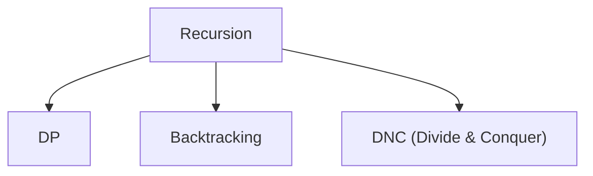

# Recursion



## 1. Understanding Recursion

### Key Points for Understanding Recursion:

**Point 1:** Why make input smaller?

- We take some decision, input gets smaller after decision
- Decision-making should be our primary goal

**Point 2:** How to determine recursion problem?

- Choices + Decisions

**Point 3:** Recursive tree

- It is a visual representation to understand and analyze the recursive process

## 2. Problem Solving Approaches

### 4 approaches to solve a recursion problem:

- Recursive tree
- Base condition - Induction - Hypothesis (making input smaller)
- Choice diagram (DP)
- Design hypothesis

### Base condition:

- Smallest valid IP
- Smallest invalid IP

### 2 steps to solve recursion problem:

1. Design a recursive tree
2. Write code, **that's it**

### Flow of solving recursive problem should be like this:

```
IBH -> recursive tree -> choice diagram
```

## 3. Problem Categories

### Problems based on IP-OP method

- Print 1 to n/n to 1
- Sort an array
- Delete middle element in a stack
- Remove duplicates from string
- Count the number of occurrences
- Subset
- Permutation & SPACE (variations)
- Josephus problem

### Extended IP-OP method

- Binary string
- Generate balanced parenthesis

## 4. Practical Examples

### Example: Factorial

Ex. n = 5  `5*4*3*2*1 = 120`

**Step 1:** Design hypothesis

- factorial(5) → `5 * 4 * 3 * 2 * 1` factorial(n)
- factorial(4) → `4 * 3 * 2 * 1` factorial(n-1)

**Step 2:** Induction

- factorial(n) = n * factorial(n-1)

### Example: Print 1 to n

**Step 1:** Design hypothesis

ex. n = 7

- print(n) → 1 2 3 4 5 6 7
- print(n-1) → 1 2 3 4 5 6 //applying on a smaller input size

**Step 2:** Induction

**Step 3:** Base condition

```
-----------------------------------------
                (1    n-4 n-3 n-2 n-1 n)
```

Base case would be the smallest valid input which is '1' in this case

```cpp
if(n == 1){
    return 1;
}
```

## 5. Code Examples

### Code Example: Print 1 to n

```cpp
void print(int n){
    if(n == 1){   //BASE CASE
        cout << n << endl;
        return;
    }
    print(n-1);   //HYPOTHESIS
    cout << n << endl;  //INDUCTION
}
```

### Code Example: Sort an array recursively

```cpp
void sort(vector<int> &v){
    if(v.size() == 1){
        return;
    }
    int temp = v[v.size()-1];
    v.pop_back();
    sort(v);
    insertEle(v, temp);
}

void insertEle(vector<int> &v, int temp){
    if(v.size()==0 || v[v.size()-1] <= temp){
        v.push_back(temp);
        return;
    }
    int val = v[v.size()-1];
    v.pop_back();
    insertEle(v, temp);
    v.push_back(val);
}
```